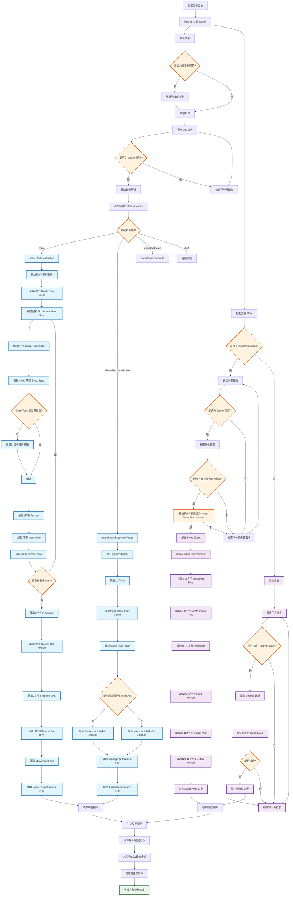

# Jupiter 交易解析流程

本文档描述了 Jupiter 交易解析的完整流程，包括指令解析和事件解析两个主要部分。

## 流程图

## 流程说明

### 主要组件

1. **指令解析**（蓝色节点）
- 处理不同类型的 Jupiter 指令
- 包括 route、sharedAccountsRoute 和 exactOutRoute

2. **事件解析**（紫色节点）
- 从内部指令和日志中提取 Swap Event
- 解析交易执行后的实际结果

3. **决策点**（橙色节点）
- 各种条件判断和分支逻辑

4. **最终结果**（绿色节点）
- 生成完整的交易分析结果

### 关键流程

1. **交易获取与解析**：从 RPC 获取交易数据，处理版本化交易
2. **指令解析**：识别 Jupiter 程序指令并解析其参数
3. **事件解析**：从内部指令和日志中提取 Swap Event
4. **结果汇总**：整合指令和事件数据，生成最终分析结果

### 文件建议

这个文档可以保存为：
- `docs/jupiter-transaction-parsing.md` - 包含完整说明
- `docs/api/jupiter-parsing-flow.md` - API 文档的一部分
- `README.md` 的一个章节 - 如果是项目的核心功能